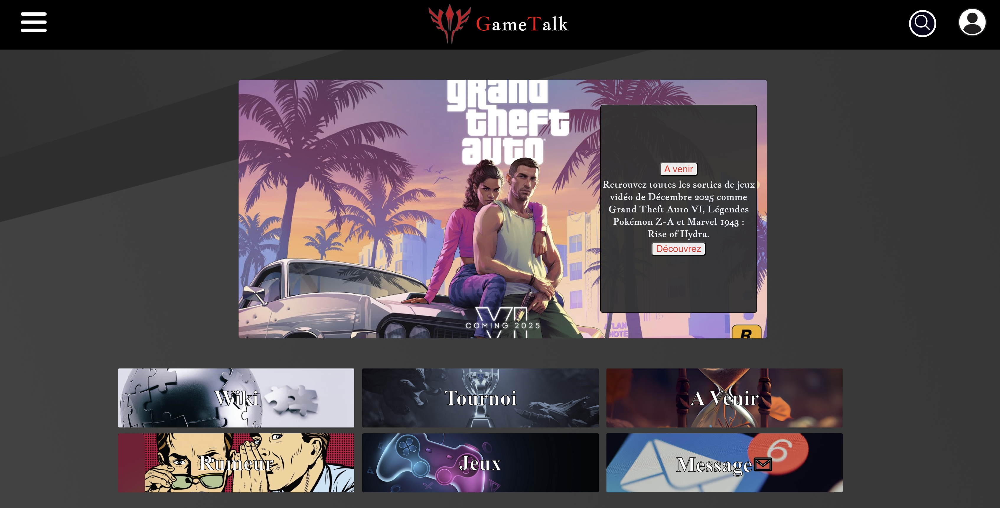

# GameTalk 🪢

Welcome to GameTalk ! This project is a forum for videogames



# Prerequisite ⏪

Somes knowledges in this field : 

- The use of Golang 
- The use of HTML, CSS and JavaScript
- The use of Git and for the code management

# Installation 🔧

1. Clone the repository.
```bash
  git clone https://github.com/B1-Info-23-24/projet-forum-gametalk.git
```
2. Reach in the repository.
```bash
  cd projet-forum-gametalk
```

# Start 🧑‍💻

1. Write this commands : 
```bash
  cd api
  go run main.go
```

2. Open an another terminal and write this commands :
```bash
  cd server
  go run main.go
```

3. Your application running on port 8080 is available then you can open it in browser. 
If you don't have the message for open it you can write this in your browser:
```bash
  http://localhost:8080/
```

4. If you have a problem with CORS you must download and use this extension :
 https://chromewebstore.google.com/detail/allow-cors-access-control/lhobafahddgcelffkeicbaginigeejlf?hl=fr&utm_source=ext_sidebar
If you have a problem you only have to reload your page

# How Play ? 🔨

You arrive on the landing page.

When you log in you can click on differents categories they show you all topics existing

You can create topics if you click on the left menu 

You can acess to your profile settings in the right menu

When you see a topic you can like it or dislike it, you can also react if you click on "write a comment". You can see the other comments and also like and dislike them. You can also edit and delete your topics or comments.

## Account Recovery Service 🔒

**Important Notice :** The account recovery service (which was intended to send emails for password reset requests) has been temporarily **disabled** to prevent the exposure of sensitive API keys in the public code. The code for this feature is still accessible, but the API key has been removed for security reasons. Users will not be able to recover their accounts via email until the feature is re-enabled with a securely managed API key.

# Demonstration

You can see a video demonstration of the project here :
[](https://www.youtube.com/embed/GSwCLQN-0iA)

# Version 🗃️

golang 1.21.0

# Authors 💸

 - [Kilian Moun 🍻](https://github.com/MounKilian)
 - [Hugo Flandrin 🍻](https://github.com/HugoFlandrin)
 - [Amadou Diop 🍻](https://github.com/amadoudiop04)
 - [Brandon Lutula 🍻](https://github.com/lbrandon69)
